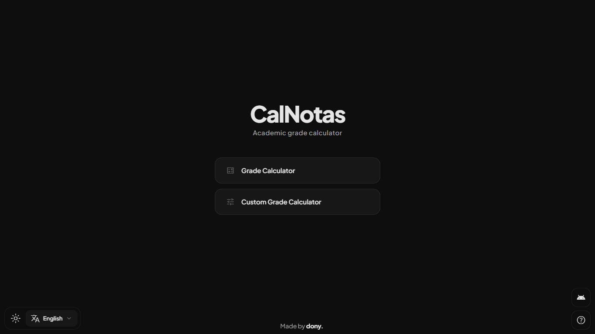

# Grade Calculator

> PWA web application for calculating academic grades at Universidad Americana (Colombia).

[](README.es.md)



## Description

The Grade Calculator allows students to enter their formative and cognitive grades across three evaluation periods. Based on the university's grading percentages, the application automatically calculates the final grades and the overall final grade.

## Features

### Default Calculator
- **Grade Input:** Enter your formative and cognitive grades in the corresponding fields.
- **Auto Calculation:** Results are calculated automatically in real time.
- **Online Help:** A help button provides instructions on how to use the calculator with a calculation example.
- **Reset:** Option to reset all fields and results.

### Custom Calculator
- **Custom Fields:** Add as many fields as needed with custom names and percentages.
- **Flexible Percentages:** Define your own percentages for each field.
- **Local Storage:** Save your custom configuration for future use.
- **Percentage Validation:** Ensures percentages add up to 100%.

### General Features
- **Theme Toggle:** Switch between light and dark mode.
- **Languages:** Support for Spanish and English with real-time translation.
- **Responsive Design:** Adapts to any device (mobile, tablet, desktop).
- **PWA:** Installable as a progressive web app.
- **Offline Mode:** Works without an internet connection.

## Access

Use the application at: [https://calnotas.vercel.app/](https://calnotas.vercel.app/)

## Usage

1. **Choose Calculator:** Select between the default or custom calculator.
2. **Default Calculator:** Enter formative and cognitive grades. Results are displayed in real time.
3. **Custom Calculator:** Create fields with custom names and percentages. Save your configuration for future use.
4. **Customization:** Switch between light/dark mode and select your preferred language (Spanish/English).

## 2025 Grading System

| Period | Formative Grade | Cognitive Grade | Total |
|--------|----------------|----------------|-------|
| Cut 1 | 15% | 15% | 30% |
| Cut 2 | 15% | 15% | 30% |
| Cut 3 | 20% | 20% | 40% |

### Example

For a Formative Grade of 4.5 and a Cognitive Grade of 3.0:

```
Cut 1: (4.5 × 0.15) + (3.0 × 0.15) = 1.13
Cut 2: (4.5 × 0.15) + (3.0 × 0.15) = 1.13
Cut 3: (4.5 × 0.20) + (3.0 × 0.20) = 1.50
Total: 1.13 + 1.13 + 1.50 = 3.76 ✓
```

The final grade must be ≥ 3.0 to pass.

## Tech Stack

- **Framework:** Angular 21
- **Styles:** CSS with variables (light/dark themes)
- **i18n:** ngx-translate (Spanish/English)
- **PWA:** Angular Service Worker
- **Deployment:** Vercel

## Development

```bash
npm start          # Dev server at http://localhost:4200
npm run build      # Production build
npm test           # Tests
```

## Credits

Developed by [dony.](https://github.com/dony-aep)

## License

[MIT](https://opensource.org/licenses/MIT)
